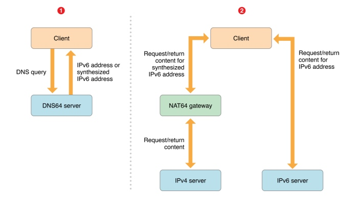
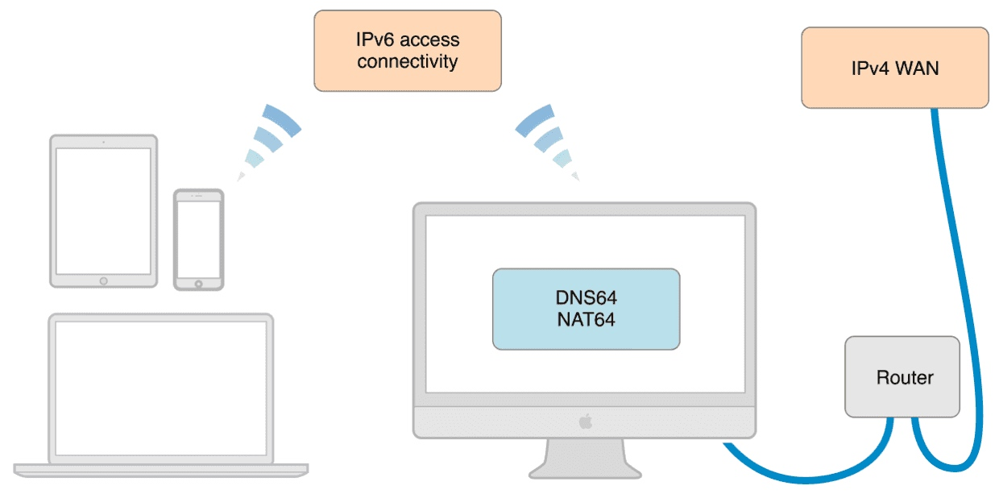

# 苹果IPv6审核解决方案

2016年6月1号之后苹果应用上传AppStore审核要求全面支持ipv6，虽然只是一个简单的审核要求，但却给中国区的开发者带来了不小的麻烦，因为众所周知的原因，国内的IPV6支持的比较差，所以包括ipv6环境测试在内的ipv6适配要求，着实是需要有一套解决方案。这里都是废话，下面就自己的解决方案开始做方案介绍。

### 代码层支持

按照苹果官方要求做iOS代码适配ipv6，这里涉及到了跟网络相关的第三方库的时候，按照我自己的经验，做如下解释：

```
1. Afnetworking  ~3.1.0.（3.0.x版本正常都是支持ipv6的）

2. SDWebImage ~3.8.1.
```
（总之，跟网络相关的库升级到最新没错了。）

这里想说的是，基本的代码层根据苹果官方的要求做配置就好。[参考链接](http://www.jianshu.com/p/a6bab07c4062)

对于SDK的支持,请尽量使用最新版的SDK进行开发。

[本地搭建IPv6测试方案](http://www.jianshu.com/p/49442934b81d)


### 网络层支持

这里有个误解，我必须要强调下。

**苹果要求支持IPv6，并不需要服务器兼容IPv6!!**


iPhone向DNS64服务请求一个域名的时候，DNS64 server 会请求上游DNS，如果有IPV6的地址的话返回V6地址，如果没有的话，会请求一个IPv4地址，然后DNS64 server 会将这个地址转换为IPv6地址，供手机访问。



IPv6 Only网络下访问IPv4网络的时候，通过NAT64网关对IPv4和IPv6进行NAT，**并不需要客户有实际的IPv6服务。**



这张图展示的是利用Mac搭建IPv6环境，可以看出Mac作为上游与公网完全是通过V4网络连接的。完全没有V6的环境。

### 网络问题根源

目前来看，绝大部分问题都是由于苹果审核人员在V6网络下测试，到国内的服务器网络质量不佳，App本身的超时逻辑设置的时间较短，导致服务出现超时，最后归咎于IPv6。

### 解决方案

我们通过在海外部署转发节点，通过国际专线经过4层无状态转发到国内的游戏服务器，绕过拥堵的国际网络出口，业务无需再做任何修改。只需要修改域名的海外解析，解析到我们的海外转发节点即可。

1. 利用全球专线部署，解决国家间网络互联问题，优化网络稳定性，提升过审概率;
2. 通过智能DNS部署，解决纯IPv6网络下程序运行，不用修改程序，方便高效;
3. 分钟级部署审核加速，省去复杂运维配置(转发集群配置，网络配置，高可用配置)，无需修改任何业务代码;


**测试部署请联系 Orangemtony@gmail.com**

### 数据对比


| 24小时平均数据对比  | 经过转发 | 未经转发 |
| :-: | :-: | :-: |
| TCP平均响应时间 | 266ms | 376ms |
| 可用率 | 99.97% | 96.55% |


#### 附：DNS64服务器搭建方案

待续


